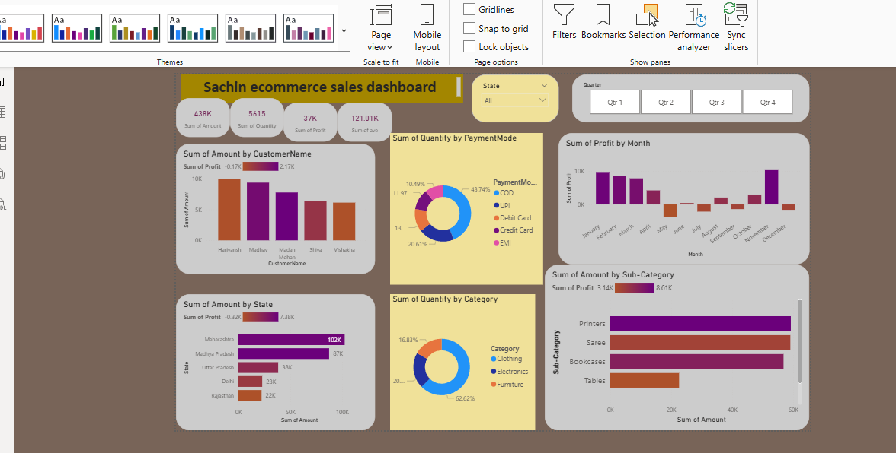

# sales-dashboard-powerbi
Sales analysis dashboard built using Power BI to visualize revenue, profit, and regional sales performance.
# Sales Dashboard (Power BI)

This project is a Sales Analysis Dashboard built using Microsoft Power BI.

## Objective
The objective of this project is to analyze sales performance and provide insights into revenue, profit, and customer behavior.

## Tools Used
- Microsoft Power BI
- Excel / CSV Dataset

## Key Insights
- Total Sales and Profit Analysis
- Monthly Sales Trends
- Regional Sales Performance
- Product Category Performance
- Top Customers by Revenue

## Dashboard Preview

## Project Files
- Sales_Dashboard.pbix : Power BI dashboard file
- sales_data.csv : Dataset used for analysis
